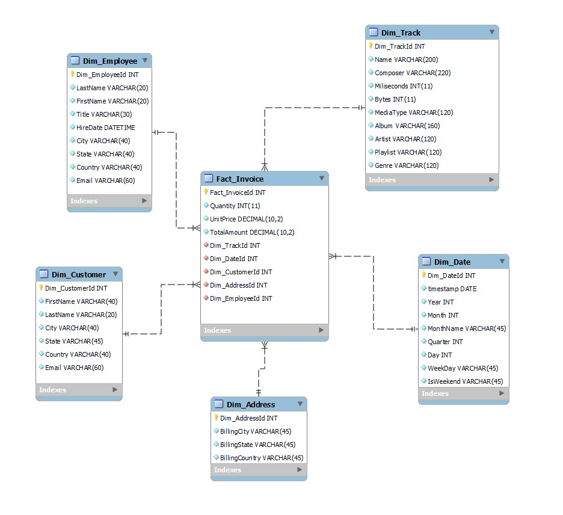
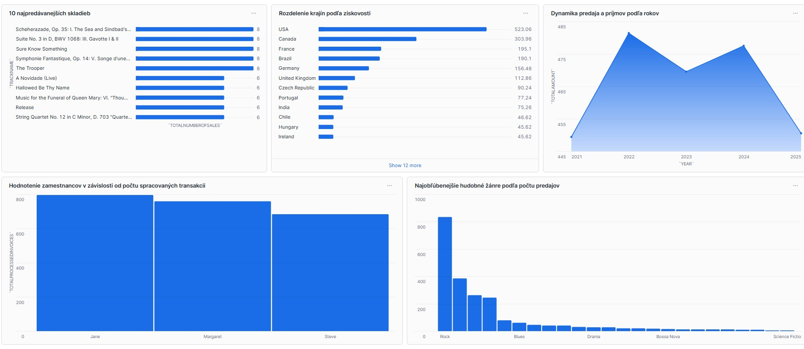

# **ETL proces datasetu Chinook**

Toto úložisko obsahuje implementáciu procesu ETL spoločnosti Snowflake na analýzu údajov zo súboru údajov **Chinook**. Cieľom projektu je analyzovať údaje hudobného obchodu Chinook s cieľom pochopiť vzorce predaja, správanie používateľov, popularitu hudobných žánrov a výkonnosť zamestnancov. Proces ETL pomôže pripraviť údaje na viacrozmernú analýzu a vizualizáciu kľúčových ukazovateľov.

____

## **1. Úvod a popis zdrojových dát**

Cieľom semestrálneho projektu je analyzovať údaje týkajúce sa hudobných skladieb, používateľov a ich nákupov. Táto analýza nám umožňuje identifikovať trendy v hudobných preferenciách zákazníkov, najobľúbenejšie skladby, žánre a zoznamy skladieb, ako aj vyhodnotiť produktivitu zamestnancov a efektivitu predaja.

Surové údaje sú relačná databáza obsahujúca informácie o:

+ Predaj hudobných skladieb.
+ Zákazníkoch a ich objednávkach.
+ Umelci, albumy a žánre.
+ Zamestnanci a zoznamy skladieb.

Účel analýzy:

+ Identifikovať najobľúbenejšie skladby, žánre a zoznamy skladieb.
+ Identifikovať geografické trendy v nákupoch.
+ Analyzovať údaje o predaji a ziskoch.
+ Vyhodnotiť produktivitu zamestnancov.

____

### **1.1 Základný opis tabuľky**

+ **Artist**: Obsahuje informácie o umelcovi. Obsahuje jedinečný identifikátor a názov.
+ **Album**: Ukladá údaje o hudobných albumoch spojených s umelcami.
+ **Track**: Hlavná tabuľka s informáciami o skladbe vrátane žánru, albumu, ceny a trvania.
+ **Genre**: Zoznam hudobných žánrov.
+ **MediaType**: Opis dostupných formátov mediálneho obsahu.
+ **Playlist**: Zoznam zoznamov skladieb vytvorených používateľmi.
+ **PlaylistTrack**: Prepojenie skladieb so zoznamami skladieb.
+ **Invoice**: Informácie o objednávkach zákazníkov.
+ **InvoiceLine**</mark>: Podrobnosti o každom riadku objednávky.
+ **Customer**: Údaje o zákazníkovi vrátane kontaktných informácií.
+ **Employee**: Informácie o zamestnancoch.

____

### **1.2 Dátová architektúra**

### **ERD diagram**

Surové dáta sa usporiadajú do relačného modelu, ktorý je reprezentovaný ako **entitno-relačný diagram (ERD)**:

<p align="center">
  <a href="Chinook_ERD.png">
    
  </a>
  <br>
 Obrázok 1 Entitno-relačná schéma Chinook
</p>

____

## **2. Dimenzionálny model**

Na efektívnu analýzu bol navrhnutý **hviezdicový model (hviezdicová schéma)**, ktorého stredobodom je tabuľka **Fact_Invoice** obsahujúca informácie o predaji hudobných skladieb.

Hlavné metriky v tabuľke fact sú:

+ **Fact_InvoiceId**: jedinečný kľúč faktúry.
+ **Quantity**: Počet zakúpených skladieb.
+ **UnitPrice**: Cena za skladbu.
+ **TotalAmount**: Celková suma faktúry.
+ **Dim_TrackId**: Odkaz na hudobnú skladbu spojenú s týmto plemenom z dimenzionálnej tabuľky **Dim_Track**.
+ **Dim_DateId**: Odkaz na dátum spojený s transakciou z dimenzionálnej tabuľky **Dim_Date**.
+ **Dim_CustomerId**: Odkaz na zákazníka z dimenzionálnej tabuľky **Dim_Customer**. 
+ **Dim_AddressId**: Odkaz na adresu, na ktorej bol nákup uskutočnený, z dimenzionálnej tabuľky **Dim_Address**.
+ **Dim_EmployeeId**: Odkaz na zamestnanca z tabuľky **Dim_Employee**.

Faktová tabuľka **Fact_Invoice** je prepojená s nasledujúcimi dimenziami:

+ **Dim_Customer**: Obsahuje informácie o zákazníkovi (jedinečné ID zákazníka, meno, adresu, kontaktné údaje atď.). Tabuľka **Fact_Invoice** používa pole **Dim_CustomerId** na komunikáciu s tabuľkou **Dim_Customer**. Toto pole udáva, ktorý zákazník uskutočnil nákup. **Dimenzia typu 2 (SCD2)** - Predpokladá sa, že zákazníci môžu meniť informácie (napríklad adresu alebo kontaktné údaje) a ukladá sa história zmien.
+ **Dim_Employee**: Obsahuje informácie o zamestnancoch (meno, priezvisko, titul, adresa a ďalšie údaje). Tabuľka **Fact_Invoice** používa pole **Dim_EmployeeId** na prepojenie s tabuľkou **Dim_Employee**, aby uviedla, ktorý zamestnanec spracoval nákup. **Dimenzia typu 2 (SCD2)** - Informácie o zamestnancovi sa môžu meniť (napríklad zmena názvu pracovnej pozície alebo adresy) a tieto zmeny sa musia zachovať.
+ **Dim_Track**: Obsahuje údaje o hudobnej skladbe (názov, trvanie, žáner a ďalšie atribúty). Tabuľka **Fact_Invoice** používa pole **Dim_TrackId** na prepojenie s tabuľkou **Dim_Track**, aby uviedla, ktorá hudobná skladba bola predaná. **Dimenzia typu 0 (SCD0)** - zmeny informácií o skladbe si nevyžadujú uloženie historických údajov, pretože neovplyvňujú analýzu.
+ **Dim_Address**: Obsahuje informácie o adrese transakcie. Tabuľka **Fact_Invoice** používa pole **Dim_AddressId** na prepojenie s tabuľkou **Dim_Address**, ktorá sa používa na určenie adresy, na ktorej sa uskutočnil nákup na trati. **Dimenzia typu 0 (SCD0)** - adresa uvádza len miesto, kde bol nákup uskutočnený, a nemení sa, história zmien nie je potrebná, pre každú transakciu je aktuálna adresa pevne stanovená.
+ **Dim_Date**: Obsahuje dátum nákupu (deň, mesiac, rok, štvrťrok, deň v týždni atď.). Tabuľka **Fact_Invoice** používa pole **Dim_DateId** na označenie dátumu uskutočnenia nákupu. **Dimenzia typu 0 (SCD0)** - údaje kalendára sa nemenia, takže nie je potrebné uchovávať históriu zmien.

Štruktúra modelu hviezdy je znázornená na nasledujúcom obrázku. Diagram znázorňuje vzťahy medzi tabuľkou faktov a meraniami, čo uľahčuje pochopenie a implementáciu modelu.

<p align="center">
  <a href="Chinook_Star_schema.png">
    
  </a>
  <br>
  Obrázok 2 Schéma hviezdy pre Chinook
</p>

____

## **3. ETL proces v Snowflake**

ETL proces pozostával z troch hlavných fáz: **extrahovanie** (Extract), **transformácia** (Transform) a **načítanie** (Load). Tento proces bol implementovaný v systéme Snowflake na prípravu surových údajov z etapovej vrstvy do viacdimenzionálneho modelu vhodného na analýzu a vizualizáciu.

____

### **3.1 Extract (Extrahovanie dát)**

Dáta zo zdrojového datasetu (formát .csv) boli najprv nahraté do Snowflake prostredníctvom interného stage úložiska s názvom BISON_Chinook_stage. Stage v Snowflake slúži ako dočasné úložisko na import alebo export dát. Vytvorenie stage bolo zabezpečené príkazom:

Príklad kódu:
```sql
CREATE OR REPLACE STAGE BISON_Chinook_stage
FILE_FORMAT = (TYPE = 'CSV' FIELD_OPTIONALLY_ENCLOSED_BY = '"');
```

Do stage boli nahrané súbory s údajmi o skladbách, zákazníkoch, príjmy, zamestnancoch, žánroch skladieb, umelcoch atď. Dáta boli importované do tabuliek pomocou príkazu COPY INTO. Pre každú tabuľku sa použil podobný príkaz:

```sql
COPY INTO `Album`
FROM @BISON_Chinook_stage/Album.csv
FILE_FORMAT = (TYPE = 'CSV' FIELD_OPTIONALLY_ENCLOSED_BY = '"' SKIP_HEADER = 1)
ON_ERROR = 'CONTINUE'; 
```

V prípade nekonzistentných záznamov bol použitý parameter ON_ERROR = 'CONTINUE', ktorý zabezpečil pokračovanie procesu bez prerušenia pri chybách.

____

### **3.2 Transfor (Transformácia dát)**

V tomto kroku sa údaje získané z exporovaných tabuliek vyčistili, transformovali a obohatili. Hlavným cieľom bolo pripraviť dimenzie a tabuľku faktov, ktoré by umožnili jednoduché a efektívne analýzy.

Dimenzie boli navrhnuté na poskytovanie kontextu pre faktovú tabuľku. Dimenzia **Dim_Employee** obsahuje informácie o zamestnancoch predajne vrátane údajov ako meno, priezvisko, pozícia, dátum povýšenia, e-mail a ich adresy.
**Typ dimenzie 2 (SCD2)** - informácie o zamestnancovi sa môžu meniť (napr. zmena pracovnej pozície alebo adresy) a tieto zmeny sa musia uložiť. Preto sa pre tento typ dimenzie musia pridať ďalšie stĺpce:
+ **StartDate** - dátum začiatku záznamu.
+ **EndDate** - dátum ukončenia platnosti záznamu (zvyčajne NULL, ak je záznam aktuálny).
+ **IsCurrent** - príznak označujúci relevantnosť záznamu (napríklad 1 pre aktuálny záznam a 0 pre neaktuálny záznam).
V budúcnosti pomôže pri načítavaní údajov skontrolovať, či sa údaje zmenili, a ak áno - vytvoriť nový záznam s aktualizovanými hodnotami a starý záznam uložiť do histórie.

Príklad kódu:
```sql 
CREATE TABLE `Dim_Employee` (
    `Dim_EmployeeId` INT,
    `LastName` VARCHAR(20),
    `FirstName` VARCHAR(20),
    `Title` VARCHAR(30),
    `HireDate` TIMESTAMP_NTZ(9),
    `City` VARCHAR(40),
    `State` VARCHAR(40),
    `Country` VARCHAR(40),
    `Email` VARCHAR(60),
    `StartDate` DATE,
    `EndDate` DATE,
    `IsCurrent` BOOLEAN
);
INSERT INTO `Dim_Employee`
SELECT 
    e.`EmployeeId` AS `Dim_EmployeeId`,
    e.`LastName`,
    e.`FirstName`,
    e.`Title`,
    e.`HireDate`,
    e.`City`,
    e.`State`,
    e.`Country`,
    e.`Email`,
    CURRENT_DATE AS `StartDate`,
    NULL AS `EndDate`,
    TRUE AS `IsCurrent`
FROM `Employee` e;
```
**CURRENT_DATE** sa používa na zaznamenanie dátumu aktuálnej zmeny v tabuľke.

Rovnakým spôsobom sa vytvorí dimenzia **Dim_Customer**, ktorá obsahuje informácie o zákazníkoch, ako je jedinečný identifikátor zákazníka, meno, adresa, kontaktné údaje atď. Typ dimenzie je rovnaký - **typ 2 (SCD2)**, pretože sa predpokladá, že zákazníci môžu meniť informácie (napríklad adresu alebo kontaktné údaje) a mala by sa ukladať história zmien.

Dimenzia **Dim_Date** je určená na ukladanie informácií o dátume nákupu skladby. Obsahuje odvodené údaje, ako je deň, mesiac, rok, deň v týždni (v textovom aj číselnom formáte) a štvrťrok. Štruktúra tejto dimenzie umožňuje podrobné časové analýzy, napríklad najvyšší počet predajov podľa dňa, mesiaca alebo roka. Z hľadiska SCD je táto dimenzia kategorizovaná ako **SCD typ 0**. To znamená, že existujúce záznamy v tejto dimenzii sú nemenné a obsahujú statické informácie.

Príklad kódu:
```sql 
CREATE TABLE `Dim_Date` AS
SELECT DISTINCT
    ROW_NUMBER() OVER (ORDER BY CAST(i.`InvoiceDate` AS DATE)) AS `Dim_DateId`,
    DATE(i.`InvoiceDate`) AS `Date`,                 
    EXTRACT(YEAR FROM i.`InvoiceDate`) AS `Year`,    
    EXTRACT(MONTH FROM i.`InvoiceDate`) AS `Month`, 
    CASE 
        WHEN EXTRACT(MONTH FROM i.`InvoiceDate`) = 1 THEN 'Január'
        WHEN EXTRACT(MONTH FROM i.`InvoiceDate`) = 2 THEN 'Február'
        WHEN EXTRACT(MONTH FROM i.`InvoiceDate`) = 3 THEN 'Marec'
        WHEN EXTRACT(MONTH FROM i.`InvoiceDate`) = 4 THEN 'Apríl'
        WHEN EXTRACT(MONTH FROM i.`InvoiceDate`) = 5 THEN 'Máj'
        WHEN EXTRACT(MONTH FROM i.`InvoiceDate`) = 6 THEN 'Jún'
        WHEN EXTRACT(MONTH FROM i.`InvoiceDate`) = 7 THEN 'Júl'
        WHEN EXTRACT(MONTH FROM i.`InvoiceDate`) = 8 THEN 'August'
        WHEN EXTRACT(MONTH FROM i.`InvoiceDate`) = 9 THEN 'September'
        WHEN EXTRACT(MONTH FROM i.`InvoiceDate`) = 10 THEN 'Október'
        WHEN EXTRACT(MONTH FROM i.`InvoiceDate`) = 11 THEN 'November'
        WHEN EXTRACT(MONTH FROM i.`InvoiceDate`) = 12 THEN 'December'
        ELSE 'Unknown'
    END AS `MonthName`,
    EXTRACT(QUARTER FROM i.`InvoiceDate`) AS `Quarter`,
    EXTRACT(DAY FROM i.`InvoiceDate`) AS `Day`,    
    CASE 
        WHEN EXTRACT(DOW FROM i.`InvoiceDate`) = 1 THEN 'Pondelok'
        WHEN EXTRACT(DOW FROM i.`InvoiceDate`) = 2 THEN 'Utorok'
        WHEN EXTRACT(DOW FROM i.`InvoiceDate`) = 3 THEN 'Streda'
        WHEN EXTRACT(DOW FROM i.`InvoiceDate`) = 4 THEN 'Štvrtok'
        WHEN EXTRACT(DOW FROM i.`InvoiceDate`) = 5 THEN 'Piatok'
        WHEN EXTRACT(DOW FROM i.`InvoiceDate`) = 6 THEN 'Sobota'
        WHEN EXTRACT(DOW FROM i.`InvoiceDate`) = 7 THEN 'Nedeľa'
        ELSE 'Unknown'
    END AS `WeekDay`,
    CASE 
        WHEN EXTRACT(DOW FROM i.`InvoiceDate`) IN (6, 7) THEN 'Víkend'
        ELSE 'Pracovný deň'
    END AS `IsWeekend`                          
FROM (SELECT DISTINCT DATE(`InvoiceDate`) AS `InvoiceDate` FROM `Invoice`) i;
```
Transformácia zahŕňala pridanie názvu mesiaca a dňa v týždni spolu s popisom typu dňa (víkend alebo nie). Boli pridané aj ďalšie typy dátumov. Dimenzie **Dim_Address** a **Dim_Track** majú rovnakú dimenziu **SCD typ 0** a boli vytvorené rovnakým spôsobom.

Tabuľka **Fact_Invoice** obsahuje informácie o počte predaných skladieb, cene za 1 skladbu a celkovej sume za všetky predané kópie. Obsahuje aj odkazy na všetky dimenzie.
```sql 
CREATE TABLE `Fact_Invoice` AS
SELECT 
    il.`InvoiceLineId` AS `Fact_InvoiceId`,
    il.`Quantity`,
    il.`UnitPrice`,
    il.`Quantity` * il.`UnitPrice` AS `TotalAmount`,
    t.`TrackId` AS `Dim_TrackId`,
    c.`CustomerId` AS `Dim_CustomerId`,
    e.`EmployeeId` AS `Dim_EmployeeId`,
    da.`Dim_AddressId` AS `Dim_AddressId`,
    d.`Dim_DateId` AS `Dim_DateId`         
FROM `InvoiceLine` il
JOIN `Track` t ON il.`TrackId` = t.`TrackId`
JOIN `Invoice` i ON il.`InvoiceId` = i.`InvoiceId`
JOIN `Customer` c ON i.`CustomerId` = c.`CustomerId`
JOIN `Employee` e ON c.`SupportRepId` = e.`EmployeeId`
JOIN `Dim_Address` da ON i.`BillingCity` = da.`BillingCity`
JOIN `Dim_Date` d ON DATE(i.`InvoiceDate`) = d.`Date`
ORDER BY `Fact_InvoiceId`;
```

____

### **3.3 Load (Načítanie dát)**

Po úspešnom vytvorení dimenzie a tabuľky faktov sa údaje načítali do konečnej štruktúry. Nakoniec sa exportované tabuľky vymazali, aby sa optimalizovalo využitie úložiska:
```sql 
DROP TABLE IF EXISTS `InvoiceLine`;
DROP TABLE IF EXISTS `Invoice`;
DROP TABLE IF EXISTS `Artist`;
DROP TABLE IF EXISTS `Album`;
DROP TABLE IF EXISTS `Playlist`;
DROP TABLE IF EXISTS `Genre`;
DROP TABLE IF EXISTS `MediaType`;
DROP TABLE IF EXISTS `Customer`;
DROP TABLE IF EXISTS `Employee`;
DROP TABLE IF EXISTS `Track`;
DROP TABLE IF EXISTS `PlaylistTrack`;
```

ETL proces v **Snowflake** umožnil spracovanie pôvodných dát z **.csv** formátu do viacdimenzionálneho modelu typu hviezda. Tento proces zahŕňal čistenie, obohacovanie a reorganizáciu údajov. Výsledný model umožňuje analyzovať preferencie poslucháčov a kúpnu silu a poskytuje základ pre vizualizácie a reporty.

____

## **4. Vizualizácia dát**

Dashboard obsahuje 5 vizualizácií, ktoré poskytujú základný prehľad kľúčových metrikách a trendov týkajúcich sa hudobných skladieb, používateľov, zamestnancov a predajných skladieb. Tieto vizualizácie odpovedajú na dôležité otázky a umožňujú lepšie pochopiť preferencie používateľov, výkonnosť zamestnancov a celkové príjmy.

<p align="center">
  <a href="Chinook_dashboard_visualizations.png">
    
  </a>
  <br>
  Obrázok 3 Dashboard Chinook datasetu
</p>

____

### **Graf 1: 10 najpredávanejších skladieb**

Táto vizualizácia zobrazuje 10 najpredávanejších skladieb. Umožňuje identifikovať skladby, ktoré sú pre poslucháčov najzaujímavejšie. Pomocou tohto grafu môžete napríklad zistiť, že skladba **The Trooper** je medzi poslucháčmi jednou z najpredávanejších. Tieto informácie môžete použiť na vytvorenie odporúčaní pre poslucháčov alebo reklamných kampaní. 
```sql 
SELECT 
    t.`Name` AS `TrackName`, 
    SUM(f.`Quantity`) AS `TotalNumberOfSales`
FROM `Fact_Invoice` f
JOIN `Dim_Track` t ON f.`Dim_TrackId` = t.`Dim_TrackId`
GROUP BY t.`Name`
ORDER BY `TotalNumberOfSales` DESC
LIMIT 10;
```
____

### **Graf 2: Rozdelenie krajín podľa ziskovosti**

Tento graf zobrazuje rozdelenie objednávok podľa krajiny, z ktorej pochádza najviac príjmov. Táto vizualizácia pomáha identifikovať cieľovú skupinu a najsolventnejší trh. Z tohto grafu vidíte, že krajiny ako USA a Kanada sú najpriaznivejšími regiónmi pre predaj. Tieto informácie sa dajú využiť na identifikáciu cieľového trhu alebo na určenie, v ktorých regiónoch treba zvýšiť reklamu, aby sa prilákali noví zákazníci.
```sql 
SELECT 
    a.`BillingCountry` AS `CountryName`, 
    SUM(f.`TotalAmount`) AS `TotalAmount`
FROM `Fact_Invoice` f
JOIN `Dim_Address` a ON f.`Dim_AddressId` = a.`Dim_AddressId`
GROUP BY a.`BillingCountry`
ORDER BY `TotalAmount` DESC;
```
____

### **Graf 3: Dynamika predaja a príjmov podľa rokov**

Tento graf zobrazuje dynamiku predaja a príjmov za 5 rokov. Z tohto grafu je zrejmé, že predaj v roku 2025 sa vrátil na počet predajov v roku 2021. Predaj však kriticky neklesol a vo všeobecnosti sa stav predaja javí ako stabilný. Tieto údaje možno použiť na analýzu efektívnosti a stavu predaja za 5 rokov. 
```sql 
SELECT 
    d.`Year` AS `Year`, 
    SUM(f.`TotalAmount`) AS `TotalAmount`
FROM `Fact_Invoice` f
JOIN `Dim_Date` d ON f.`Dim_DateId` = d.`Dim_DateId`
GROUP BY d.`Year`
ORDER BY d.`Year` ASC;
```
____

### **Graf 4: Hodnotenie zamestnancov v závislosti od počtu spracovaných transakcií**

Tento graf pomáha rozdeliť zamestnancov predajne podľa počtu spracovaných transakcií, čím umožňuje porovnať efektivitu zamestnancov. Na tomto grafe môžete vidieť, že **Jane** spracovala najväčší počet transakcií a je najefektívnejším a najhodnotnejším zamestnancom. Túto informáciu možno použiť na hodnotenie kvality práce zamestnancov predajne.
```sql 
SELECT 
    e.`FirstName` AS `FirstName`, 
    e.`LastName` AS `LastName`, 
    COUNT(f.`Fact_InvoiceId`) AS `TotalProcessedInvoices`
FROM `Fact_Invoice` f
JOIN `Dim_Employee` e ON f.`Dim_EmployeeId` = e.`Dim_EmployeeId`
GROUP BY e.`FirstName`, e.`LastName`
ORDER BY `TotalProcessedInvoices` DESC;
```
____

### **Graf 5: Najobľúbenejšie hudobné žánre podľa počtu predajov**

Táto vizualizácia poskytuje zoznam najpopulárnejších hudobných žánrov na základe počtu predaných skladieb daného žánru. Z grafu je vidieť, že najpopulárnejším a najvyhľadávanejším žánrom je **Rock** a najpopulárnejším žánrom je **Science Fictio**. Tieto údaje možno využiť na zvýšenie odporúčaní napríklad žánru **Rock** a doplnenie databázy o nové skladby tohto žánru. 
```sql 
SELECT 
    sub.`Genre` AS `GenreName`, 
    SUM(sub.`Quantity`) AS `TotalNumberOfSales`
FROM (
    SELECT DISTINCT 
        f.`Fact_InvoiceId`, 
        t.`Genre`, 
        f.`Quantity`
    FROM `Fact_Invoice` f
    JOIN `Dim_Track` t ON f.`Dim_TrackId` = t.`Dim_TrackId`
) sub
GROUP BY sub.`Genre`
ORDER BY `TotalNumberOfSales` DESC;
```

Dashboard poskytuje komplexný pohľad na údaje a odpovedá na dôležité otázky o preferenciách poslucháčov a výkonnosti predaja. Vizualizácie umožňujú jednoduchú interpretáciu údajov a možno ich použiť na optimalizáciu odporúčacích systémov, vývoj marketingových stratégií, zvýšenie lojality poslucháčov a zlepšenie kvality hudobného obsahu.

____

**Autor**: Liubym Naval


