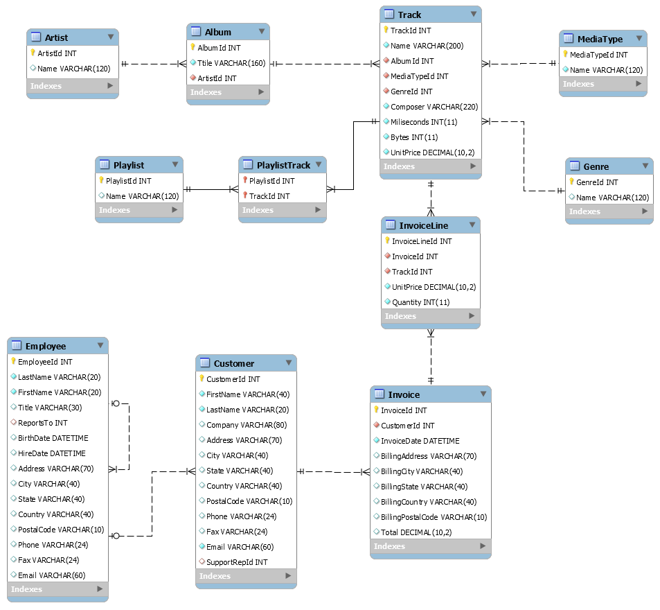

# **ETL proces datasetu Chinook**

Toto úložisko obsahuje implementáciu procesu ETL spoločnosti Snowflake na analýzu údajov zo súboru údajov **Chinook**. Cieľom projektu je analyzovať údaje hudobného obchodu Chinook s cieľom pochopiť vzorce predaja, správanie používateľov, popularitu hudobných žánrov a výkonnosť zamestnancov. Proces ETL pomôže pripraviť údaje na viacrozmernú analýzu a vizualizáciu kľúčových ukazovateľov.

____

## **1. Úvod a popis zdrojových dát**

Cieľom semestrálneho projektu je analyzovať údaje týkajúce sa hudobných skladieb, používateľov a ich nákupov. Táto analýza nám umožňuje identifikovať trendy v hudobných preferenciách zákazníkov, najobľúbenejšie skladby, žánre a zoznamy skladieb, ako aj vyhodnotiť produktivitu zamestnancov a efektivitu predaja.

Surové údaje sú relačná databáza obsahujúca informácie o:

+ Predaj hudobných skladieb.
+ Zákazníkoch a ich objednávkach.
+ Umelci, albumy a žánre.
+ Zamestnanci a zoznamy skladieb.

Účel analýzy:

+ Identifikovať najobľúbenejšie skladby, žánre a zoznamy skladieb.
+ Identifikovať geografické trendy v nákupoch.
+ Analyzovať údaje o predaji a ziskoch.
+ Vyhodnotiť produktivitu zamestnancov.

____

## **1.1 Základný opis tabuľky**

+ **Artist**: Obsahuje informácie o umelcovi. Obsahuje jedinečný identifikátor a názov.
+ **Album**: Ukladá údaje o hudobných albumoch spojených s umelcami.
+ **Track**: Hlavná tabuľka s informáciami o skladbe vrátane žánru, albumu, ceny a trvania.
+ **Genre**: Zoznam hudobných žánrov.
+ **MediaType**: Opis dostupných formátov mediálneho obsahu.
+ **Playlist**: Zoznam zoznamov skladieb vytvorených používateľmi.
+ **PlaylistTrack**: Prepojenie skladieb so zoznamami skladieb.
+ **Invoice**: Informácie o objednávkach zákazníkov.
+ **InvoiceLine**</mark>: Podrobnosti o každom riadku objednávky.
+ **Customer**: Údaje o zákazníkovi vrátane kontaktných informácií.
+ **Employee**: Informácie o zamestnancoch.

____

## **1.2 Dátová architektúra**

## **ERD diagram**

Surové dáta sa usporiadajú do relačného modelu, ktorý je reprezentovaný ako **entitno-relačný diagram (ERD)**:

  
   
 Obrázok 1 Entitno-relačná schéma Chinook

____

## **2. Dimenzionálny model**

Na efektívnu analýzu bol navrhnutý **hviezdicový model (hviezdicová schéma)**, ktorého stredobodom je tabuľka **Fact_Invoice** obsahujúca informácie o predaji hudobných skladieb.

Hlavné metriky v tabuľke fact sú:

+ **Fact_InvoiceId**: jedinečný kľúč faktúry.
+ **Quantity**: Počet zakúpených skladieb.
+ **UnitPrice**: Cena za skladbu.
+ **TotalAmount**: Celková suma faktúry.
+ **Dim_TrackId**: Odkaz na hudobnú skladbu spojenú s týmto plemenom z dimenzionálnej tabuľky **Dim_Track**.
+ **Dim_TimeId**: Odkaz na čas uskutočnenia transakcie z dimenzionálnej tabuľky **Dim_Time**.
+ **Dim_DateId**: Odkaz na dátum spojený s transakciou z dimenzionálnej tabuľky **Dim_Date**.
+ **Dim_CustomerId**: Odkaz na zákazníka z dimenzionálnej tabuľky **Dim_Customer**. 
+ **Dim_AddressId**: Odkaz na adresu, na ktorej bol nákup uskutočnený, z dimenzionálnej tabuľky **Dim_Address**.
+ **Dim_EmployeeId**: Odkaz na zamestnanca z tabuľky **Dim_Employee**.

Faktová tabuľka **Fact_Invoice** je prepojená s nasledujúcimi dimenziami:

+ **Dim_Customer**: Obsahuje informácie o zákazníkovi (jedinečné ID zákazníka, meno, adresu, kontaktné údaje atď.). Tabuľka **Fact_Invoice** používa pole **Dim_CustomerId** na komunikáciu s tabuľkou **Dim_Customer**. Toto pole udáva, ktorý zákazník uskutočnil nákup. **Dimenzia typu 2 (SCD2)** - Predpokladá sa, že zákazníci môžu meniť informácie (napríklad adresu alebo kontaktné údaje) a ukladá sa história zmien.
+ **Dim_Employee**: Obsahuje informácie o zamestnancoch (meno, priezvisko, titul, adresa a ďalšie údaje). Tabuľka **Fact_Invoice** používa pole **Dim_EmployeeId** na prepojenie s tabuľkou **Dim_Employee**, aby uviedla, ktorý zamestnanec spracoval nákup. **Dimenzia typu 2 (SCD2)** - Informácie o zamestnancovi sa môžu meniť (napríklad zmena názvu pracovnej pozície alebo adresy) a tieto zmeny sa musia zachovať.
+ **Dim_Track**: Obsahuje údaje o hudobnej skladbe (názov, trvanie, žáner a ďalšie atribúty). Tabuľka **Fact_Invoice** používa pole **Dim_TrackId** na prepojenie s tabuľkou **Dim_Track**, aby uviedla, ktorá hudobná skladba bola predaná. **Dimenzia typu 1 (SCD1)** - zmeny informácií o skladbe si nevyžadujú uloženie historických údajov, pretože neovplyvňujú analýzu.
+ **Dim_Address**: Obsahuje informácie o adrese transakcie. Tabuľka **Fact_Invoice** používa pole **Dim_AddressId** na prepojenie s tabuľkou **Dim_Address**, ktorá sa používa na určenie adresy, na ktorej sa uskutočnil nákup na trati. **Dimenzia typu 1 (SCD1)** - adresa uvádza len miesto, kde bol nákup uskutočnený, a nemení sa, história zmien nie je potrebná, pre každú transakciu je aktuálna adresa pevne stanovená.
+ **Dim_Date**: Obsahuje dátum nákupu (deň, mesiac, rok, štvrťrok, deň v týždni atď.). Tabuľka **Fact_Invoice** používa pole **Dim_DateId** na označenie dátumu uskutočnenia nákupu. **Dimenzia typu 1 (SCD1)** - údaje kalendára sa nemenia, takže nie je potrebné uchovávať históriu zmien.
+ **Dim_Time**: Obsahuje podrobné časové údaje (hodiny, AM/PM). Tabuľka **Fact_Invoice** používa pole **Dim_TimeId** na uvedenie presného času uskutočnenia platby. **Typ dimenzie Typ 1 (SCD1)** - časové údaje sa nemenia a nie je potrebné ukladať históriu.

Štruktúra modelu hviezdy je znázornená na nasledujúcom obrázku. Diagram znázorňuje vzťahy medzi tabuľkou faktov a meraniami, čo uľahčuje pochopenie a implementáciu modelu.

  
   
  Obrázok 2 Schéma hviezdy pre Chinook

____

