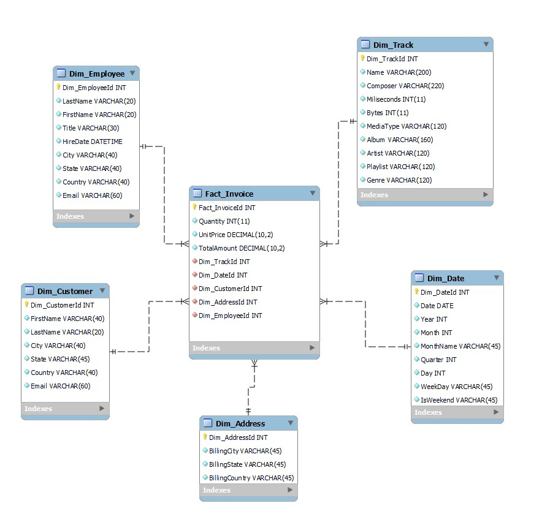

# **ETL proces datasetu Chinook**

Toto úložisko obsahuje implementáciu procesu ETL spoločnosti Snowflake na analýzu údajov zo súboru údajov **Chinook**. Cieľom projektu je analyzovať údaje hudobného obchodu Chinook s cieľom pochopiť vzorce predaja, správanie používateľov, popularitu hudobných žánrov a výkonnosť zamestnancov. Proces ETL pomôže pripraviť údaje na viacrozmernú analýzu a vizualizáciu kľúčových ukazovateľov.

____

## **1. Úvod a popis zdrojových dát**

Cieľom semestrálneho projektu je analyzovať údaje týkajúce sa hudobných skladieb, používateľov a ich nákupov. Táto analýza nám umožňuje identifikovať trendy v hudobných preferenciách zákazníkov, najobľúbenejšie skladby, žánre a zoznamy skladieb, ako aj vyhodnotiť produktivitu zamestnancov a efektivitu predaja.

Surové údaje sú relačná databáza obsahujúca informácie o:

+ Predaj hudobných skladieb.
+ Zákazníkoch a ich objednávkach.
+ Umelci, albumy a žánre.
+ Zamestnanci a zoznamy skladieb.

Účel analýzy:

+ Identifikovať najobľúbenejšie skladby, žánre a zoznamy skladieb.
+ Identifikovať geografické trendy v nákupoch.
+ Analyzovať údaje o predaji a ziskoch.
+ Vyhodnotiť produktivitu zamestnancov.

____

## **1.1 Základný opis tabuľky**

+ <mark>**Artist**</mark>: Obsahuje informácie o umelcovi. Obsahuje jedinečný identifikátor a názov.
+ <mark>**Album**</mark>: Ukladá údaje o hudobných albumoch spojených s umelcami.
+ <mark>**Track**</mark>: Hlavná tabuľka s informáciami o skladbe vrátane žánru, albumu, ceny a trvania.
+ <mark>**Genre**</mark>: Zoznam hudobných žánrov.
+ <mark>**MediaType**</mark>: Opis dostupných formátov mediálneho obsahu.
+ <mark>**Playlist**</mark>: Zoznam zoznamov skladieb vytvorených používateľmi.
+ <mark>**PlaylistTrack**</mark>: Prepojenie skladieb so zoznamami skladieb.
+ <mark>**Invoice**</mark>: Informácie o objednávkach zákazníkov.
+ <mark>**InvoiceLine**</mark>: Podrobnosti o každom riadku objednávky.
+ <mark>**Customer**</mark>: Údaje o zákazníkovi vrátane kontaktných informácií.
+ <mark>**Employee**</mark>: Informácie o zamestnancoch.

____

## **1.2 Dátová architektúra**

## **ERD diagram**

Surové dáta sa usporiadajú do relačného modelu, ktorý je reprezentovaný ako **entitno-relačný diagram (ERD)**:

  
   
 Obrázok 1 Entitno-relačná schéma Chinook

____

## **2. Dimenzionálny model**

Na efektívnu analýzu bol navrhnutý **hviezdicový model (hviezdicová schéma)**, ktorého stredobodom je tabuľka <mark>**Fact_Invoice**</mark> obsahujúca informácie o predaji hudobných skladieb.

Hlavné metriky v tabuľke fact sú:

+ <mark>**Fact_InvoiceId**</mark>: jedinečný kľúč faktúry.
+ <mark>**Quantity**</mark>: Počet zakúpených skladieb.
+ <mark>**UnitPrice**</mark>: Cena za skladbu.
+ <mark>**TotalAmount**</mark>: Celková suma faktúry.
+ <mark>**Dim_TrackId**</mark>: Odkaz na hudobnú skladbu spojenú s týmto plemenom z dimenzionálnej tabuľky <mark>**Dim_Track**</mark>.
+ <mark>**Dim_TimeId**</mark>: Odkaz na čas uskutočnenia transakcie z dimenzionálnej tabuľky <mark>**Dim_Time**</mark>.
+ <mark>**Dim_DateId**</mark>: Odkaz na dátum spojený s transakciou z dimenzionálnej tabuľky <mark>**Dim_Date**</mark>.
+ <mark>**Dim_CustomerId**</mark>: Odkaz na zákazníka z dimenzionálnej tabuľky <mark>**Dim_Customer**</mark>. 
+ <mark>**Dim_AddressId**</mark>: Odkaz na adresu, na ktorej bol nákup uskutočnený, z dimenzionálnej tabuľky <mark>**Dim_Address**</mark>.
+ <mark>**Dim_EmployeeId**</mark>: Odkaz na zamestnanca z tabuľky <mark>**Dim_Employee**</mark>.

Faktová tabuľka <mark>**Fact_Invoice**</mark> je prepojená s nasledujúcimi dimenziami:

+ <mark>**Dim_Customer**</mark>: Obsahuje informácie o zákazníkovi (jedinečné ID zákazníka, meno, adresu, kontaktné údaje atď.). Tabuľka <mark>**Fact_Invoice**</mark> používa pole <mark>**Dim_CustomerId**</mark> na komunikáciu s tabuľkou <mark>**Dim_Customer**</mark>. Toto pole udáva, ktorý zákazník uskutočnil nákup. **Dimenzia typu 2 (SCD2)** - Predpokladá sa, že zákazníci môžu meniť informácie (napríklad adresu alebo kontaktné údaje) a ukladá sa história zmien.
+ <mark>**Dim_Employee**</mark>: Obsahuje informácie o zamestnancoch (meno, priezvisko, titul, adresa a ďalšie údaje). Tabuľka <mark>**Fact_Invoice**</mark> používa pole <mark>**Dim_EmployeeId**</mark> na prepojenie s tabuľkou <mark>**Dim_Employee**</mark>, aby uviedla, ktorý zamestnanec spracoval nákup. **Dimenzia typu 2 (SCD2)** - Informácie o zamestnancovi sa môžu meniť (napríklad zmena názvu pracovnej pozície alebo adresy) a tieto zmeny sa musia zachovať.
+ <mark>**Dim_Track**</mark>: Obsahuje údaje o hudobnej skladbe (názov, trvanie, žáner a ďalšie atribúty). Tabuľka <mark>**Fact_Invoice**</mark> používa pole <mark>**Dim_TrackId**</mark> na prepojenie s tabuľkou <mark>**Dim_Track**</mark>, aby uviedla, ktorá hudobná skladba bola predaná. **Dimenzia typu 1 (SCD1)** - zmeny informácií o skladbe si nevyžadujú uloženie historických údajov, pretože neovplyvňujú analýzu.
+ <mark>**Dim_Address**</mark>: Obsahuje informácie o adrese transakcie. Tabuľka <mark>**Fact_Invoice**</mark> používa pole <mark>**Dim_AddressId**</mark> na prepojenie s tabuľkou <mark>**Dim_Address**</mark>, ktorá sa používa na určenie adresy, na ktorej sa uskutočnil nákup na trati. **Dimenzia typu 1 (SCD1)** - adresa uvádza len miesto, kde bol nákup uskutočnený, a nemení sa, história zmien nie je potrebná, pre každú transakciu je aktuálna adresa pevne stanovená.
+ <mark>**Dim_Date**</mark>: Obsahuje dátum nákupu (deň, mesiac, rok, štvrťrok, deň v týždni atď.). Tabuľka <mark>**Fact_Invoice**</mark> používa pole <mark>**Dim_DateId**</mark> na označenie dátumu uskutočnenia nákupu. **Dimenzia typu 1 (SCD1)** - údaje kalendára sa nemenia, takže nie je potrebné uchovávať históriu zmien.
+ <mark>**Dim_Time**</mark>: Obsahuje podrobné časové údaje (hodiny, AM/PM). Tabuľka <mark>**Fact_Invoice**</mark> používa pole <mark>**Dim_TimeId**</mark> na uvedenie presného času uskutočnenia platby. **Typ dimenzie Typ 1 (SCD1)** - časové údaje sa nemenia a nie je potrebné ukladať históriu.

Štruktúra modelu hviezdy je znázornená na nasledujúcom obrázku. Diagram znázorňuje vzťahy medzi tabuľkou faktov a meraniami, čo uľahčuje pochopenie a implementáciu modelu.

  
   
  Obrázok 2 Schéma hviezdy pre Chinook

____

